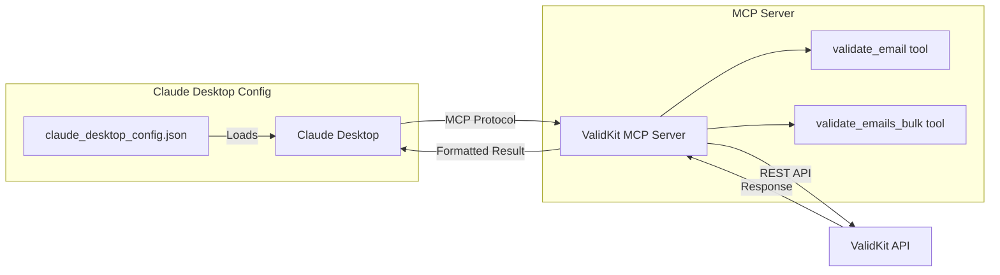

# ValidKit MCP Server Architecture

## How It Works



## Message Flow

### 1. Tool Discovery
```json
// Claude -> MCP Server
{
  "method": "tools/list"
}

// MCP Server -> Claude
{
  "tools": [
    {
      "name": "validate_email",
      "description": "Validate a single email address"
    },
    {
      "name": "validate_emails_bulk", 
      "description": "Validate multiple emails"
    }
  ]
}
```

### 2. Email Validation Request
```json
// Claude -> MCP Server
{
  "method": "tools/call",
  "params": {
    "name": "validate_email",
    "arguments": {
      "email": "test@example.com"
    }
  }
}

// MCP Server -> ValidKit API
POST /v1/verify
{
  "email": "test@example.com"
}

// ValidKit API -> MCP Server -> Claude
{
  "content": [{
    "type": "text",
    "text": "Email: test@example.com\nStatus: valid\nValid: true"
  }]
}
```

## Benefits

1. **Native Integration** - Works directly in Claude Desktop
2. **Token Efficient** - Compact responses by default
3. **No Code Required** - Just configuration
4. **Real-time Validation** - Direct API access
5. **Bulk Support** - Validate up to 1000 emails at once